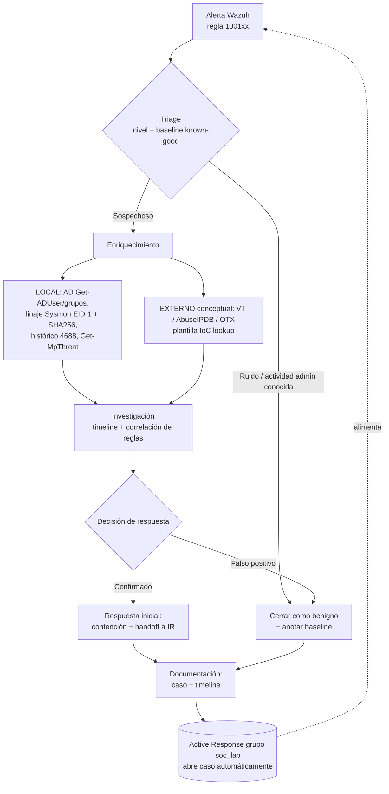

# Proyecto 1 — SOC Automation Playbook

> Marco operativo (proceso + plantillas + runbooks + automatización) que envuelve mis detecciones de Wazuh para convertir una alerta cruda en un caso triado, enriquecido y respondido de forma consistente y reproducible.

---

## El problema que resuelve

Las reglas de detección son solo la mitad del trabajo. Una regla que dispara no es una respuesta: sin un **proceso** alrededor, el analista improvisa, el triage es inconsistente, el ruido entierra lo importante y el tiempo de respuesta depende de quién esté de guardia.

Este proyecto es ese proceso. No añade detecciones nuevas (eso es el Proyecto 3); aporta el **playbook** que estandariza qué hacer cuando una de esas detecciones dispara:

- **Reduce ruido** — un árbol de triage y una baseline de *known-good* (actividad de administración legítima del lab) separan el evento real del ruido operativo antes de escalar.
- **Acelera la respuesta** — cada detección tiene un runbook con pasos deterministas de validación, enriquecimiento y contención inicial, en lugar de investigación ad-hoc.
- **Hace la respuesta reproducible** — plantillas de caso y de timeline garantizan que dos analistas distintos documenten lo mismo, y que el handoff a IR sea limpio.

El entorno es un lab Active Directory `corp.local` **aislado** (Hyper-V, red LAB-Net sin internet): `DC01` (Windows Server 2025, KDC/AD DS/DNS), `WIN11` (Windows 11 Pro con Sysmon + Microsoft Defender) y un **Wazuh 4.13.1** self-hosted como SIEM. La operación es por PowerShell Direct desde el host.

---

## El flujo: Alerta → Triage → Enriquecimiento → Investigación → Respuesta → Documentación



El ciclo lo definen cuatro documentos núcleo en `playbook/`:

| Documento | Rol en el flujo |
|---|---|
| [`playbook/00-alert-lifecycle.md`](playbook/00-alert-lifecycle.md) | Ciclo de vida completo de la alerta, de extremo a extremo |
| [`playbook/triage-and-severity.md`](playbook/triage-and-severity.md) | Cómo clasificar por nivel y descartar contra la baseline |
| [`playbook/enrichment.md`](playbook/enrichment.md) | Enriquecimiento local (real) vs. externo (conceptual) |
| [`playbook/response-decision-tree.md`](playbook/response-decision-tree.md) | Árbol de decisión: contener, escalar o cerrar |

---

## Runbooks

Seis runbooks operativos, uno por familia de detección. Cada uno enlaza la regla de Wazuh que lo dispara (Proyecto 3) con su técnica MITRE ATT&CK y los pasos de validación/respuesta.

| Runbook | Regla(s) | Detección | ATT&CK |
|---|---|---|---|
| [RB-100110 — Kerberoasting (honeypot `svc_sql`)](runbooks/RB-100110-kerberoasting.md) | 100110 (n12), 100111 (n10) | TGS al señuelo `svc_sql` (determinista) + RC4 clásico | [T1558.003](https://attack.mitre.org/techniques/T1558/003/) |
| [RB-100140 — AS-REP Roasting](runbooks/RB-100140-asrep-roasting.md) | 100140 (n12) | 4768 con `preAuthType 0` (sin preautenticación) | [T1558.004](https://attack.mitre.org/techniques/T1558/004/) |
| [RB-100120 — PowerShell ofuscado / cradles](runbooks/RB-100120-powershell-obfuscation.md) | 100120 (n12) | 4104 con `FromBase64String` / `IEX` / `DownloadString` / `-EncodedCommand` | [T1059.001](https://attack.mitre.org/techniques/T1059/001/) + [T1027](https://attack.mitre.org/techniques/T1027/) |
| [RB-100130 — Tamper de Microsoft Defender](runbooks/RB-100130-defender-tampering.md) | 100130 (n12) | `Add-MpPreference` / `-ExclusionPath` / `DisableRealtimeMonitoring` | [T1562.001](https://attack.mitre.org/techniques/T1562/001/) |
| [RB-100150 — Descarga vía LOLBin](runbooks/RB-100150-lolbin-download.md) | 100150 / 100151 / 100152 (n10) | `certutil` / `bitsadmin /transfer` / `mshta http` | [T1105](https://attack.mitre.org/techniques/T1105/) |
| [RB-100160 — Detección/acción de Defender (EDR como pista)](runbooks/RB-100160-defender-detection.md) | 100160 (n12), 100161 (n10) | Defender EID 1116 (detección) / 1117 (bloqueo·cuarentena) | pivote de caza (cadena correlacionada) |

> Detecciones adicionales del Proyecto 3 que aún no tienen runbook dedicado: AS-REP **sin disparo real** todavía (requiere Rubeus/impacket) y la candidata **100170** (servicios nuevos 7045 con `imagePath` sospechoso, [T1543.003](https://attack.mitre.org/techniques/T1543/003/)).

---

## Cómo encaja con el resto del portfolio

Este playbook es la **capa de proceso** que conecta tres proyectos de detección/respuesta:

- **← Proyecto 3 (Detecciones).** Las reglas `1001xx` viven en `/var/ossec/etc/rules/local_rules.xml` del manager Wazuh. El Proyecto 3 las **escribe**; este playbook define **qué se hace cuando disparan**. Los honeypots son la fuente de verdad: `svc_sql` (SPN `MSSQLSvc/sql01.corp.local:1433`, RC4 habilitado) para Kerberoasting y `a.garcia` (`DoesNotRequirePreAuth=True`) para AS-REP.
- **← Proyecto 2 (Caza).** La caza alimenta el **triage**. Tres hallazgos clave bajan el ruido y endurecen las reglas:
  1. **Baseline de known-good** — la mayoría del "ruido sospechoso" era actividad de admin (PS-remoting, reinstalación de Sysmon). El triage descarta contra esa baseline antes de escalar.
  2. **El mito del RC4** — WS2025 negocia AES (`0x12`) y la firma RC4 `0x17` se evade; por eso el **honeypot `svc_sql` es la detección robusta**, no la firma de cifrado.
  3. **Defensa en profundidad** — Defender detectó+bloqueó el `certutil` como `Trojan:Win32/Ceprolad.A` (1116/1117), y ese EDR se usa además como **pista/pivote de caza**.
- **→ Proyecto 4 (Incident Response).** Este playbook llega hasta la **respuesta inicial y el handoff a IR**. El ciclo IR completo **PICERL** (Prepare / Identify / Contain / Eradicate / Recover / Lessons) se profundiza en el Proyecto 4; aquí se entrega el caso ya triado, enriquecido y documentado.

---

## La automatización que cierra el ciclo

El SIEM es Wazuh, así que la automatización nativa es **Wazuh Active Response**. Este proyecto demuestra una AR **lado-manager** que **abre un caso automáticamente ante cualquier detección del lab** (grupo `soc_lab`, reglas `100110`–`100161`: Kerberoasting, AS-REP, PowerShell ofuscado, tamper de Defender, LOLBins y detección de Defender).

- La acción es **segura y de solo lectura**: apertura de ticket + enriquecimiento, sin tocar el endpoint.
- Convierte el playbook de manual a **semi-automático**: la alerta crítica genera el caso sola, y el analista entra directamente en la fase de enriquecimiento/investigación.
- No usa Logic Apps / Sentinel — esa sería la variante cloud. Aquí todo es self-hosted en el lab aislado.

Detalle de implementación en [`automation/wazuh-active-response.md`](automation/wazuh-active-response.md).

---

## Estructura de carpetas

```
projects/01-soc-automation-playbook/
├── README.md                        ← este documento
├── playbook/
│   ├── 00-alert-lifecycle.md        Ciclo de vida de la alerta (extremo a extremo)
│   ├── triage-and-severity.md       Triage por nivel + baseline known-good
│   ├── enrichment.md                Enriquecimiento local (real) y externo (conceptual)
│   └── response-decision-tree.md    Árbol de decisión de respuesta
├── runbooks/
│   ├── RB-100110-kerberoasting.md       Kerberoasting / honeypot svc_sql (T1558.003)
│   ├── RB-100120-powershell-obfuscation.md  PowerShell ofuscado / cradles (T1059.001, T1027)
│   ├── RB-100130-defender-tampering.md      Tamper de Microsoft Defender (T1562.001)
│   ├── RB-100140-asrep-roasting.md          AS-REP Roasting (T1558.004)
│   ├── RB-100150-lolbin-download.md         Descarga vía LOLBin (T1105)
│   └── RB-100160-defender-detection.md      Defender como pista / pivote (EDR)
├── templates/
│   ├── alert-case-ticket.md         Plantilla de caso / ticket de alerta
│   └── investigation-timeline.md    Plantilla de timeline de investigación
└── automation/
    └── wazuh-active-response.md     AR lado-manager: abre caso ante nivel ≥ 12
```

---

## Qué demuestra este proyecto

- **Pienso en proceso, no solo en reglas.** Sé que una detección sin un playbook que la envuelva no reduce el riesgo; el valor está en el ciclo de vida completo de la alerta.
- **Triage informado por caza.** Uso una baseline de known-good real (no teórica) para descartar ruido, y entiendo por qué una detección por honeypot es más robusta que una firma evadible (el caso RC4 `0x17` vs. AES `0x12`).
- **Enriquecimiento honesto.** Distingo lo que el lab aislado permite de verdad (AD, linaje de proceso Sysmon + SHA256, histórico 4688, `Get-MpThreat`) de lo que en un SOC real se haría contra fuentes externas (VT / AbuseIPDB / OTX), documentado como plantilla conceptual.
- **Mapeo a ATT&CK.** Cada runbook ata la detección a una técnica concreta (T1558.003/004, T1059.001, T1027, T1562.001, T1105, T1543.003).
- **Automatización pragmática.** Cierro el ciclo con Wazuh Active Response nativo (apertura de caso ante las detecciones del grupo `soc_lab`), de solo lectura y sin dependencias cloud, en lugar de prometer un SOAR que el lab no sostiene.
- **Defensa en profundidad y correlación.** Trato el EDR (Defender 1116/1117) tanto como control de bloqueo como fuente de verdad para pivotar la caza, y correlaciono reglas para reconstruir la cadena de ataque.
- **Handoff limpio a IR.** El playbook termina donde empieza PICERL (Proyecto 4): un caso triado, enriquecido y documentado, listo para contención formal.