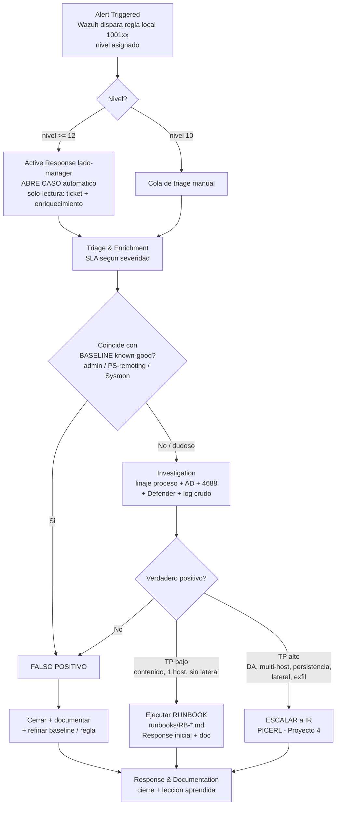

# Ciclo de vida de una alerta SOC

> Documento espina del playbook de automatización. Define el flujo extremo a extremo de una alerta desde que Wazuh la dispara hasta el handoff a Respuesta a Incidentes (IR). Los seis runbooks (`runbooks/RB-*.md`) son las instancias concretas de este flujo por detección.

## 1. Alcance y principios

El lab es **corp.local** (Hyper-V, red **LAB-Net aislada, sin internet**):

- **DC01** — Windows Server 2025, `10.10.10.10` (KDC / AD DS / DNS).
- **WIN11** — Windows 11 Pro unido al dominio, `10.10.10.21` (Sysmon + Microsoft Defender).
- **Wazuh 4.13.1** — manager `10.10.10.20`, reglas en `/var/ossec/etc/rules/local_rules.xml`.
- **Operación** por PowerShell Direct desde el host (sin red).

Principios del ciclo de vida:

1. **El nivel de la alerta dirige el flujo.** Wazuh asigna nivel por regla; el nivel marca el SLA y el camino (FP / TP bajo / TP alto).
2. **El enriquecimiento externo es CONCEPTUAL** (lab aislado): VirusTotal / AbuseIPDB / OTX se documentan como plantilla de IoC lookup, no se ejecutan. El enriquecimiento **real es LOCAL**: AD, linaje de proceso Sysmon, histórico 4688, Defender, log crudo.
3. **Baseline de known-good primero.** El hallazgo de caza (Proyecto 2) demostró que la mayoría del ruido era actividad de ADMIN (PS-remoting, reinstalación de Sysmon). Triage compara siempre contra ese baseline antes de declarar TP.
4. **El honeypot es la detección robusta.** El "mito del RC4" (WS2025 negocia AES `0x12`, la firma RC4 `0x17` se evade) hace que `100110` (TGS hacia `svc_sql`) sea determinista y prioritario sobre `100111`.

## 2. Diagrama del flujo



## 3. Fases del ciclo

### Fase 1 — Alert Triggered

Wazuh evalúa el evento contra `local_rules.xml` y emite la alerta a `/var/ossec/logs/alerts/alerts.json`. El **nivel** es el primer clasificador:

| Nivel | Detecciones | Significado operativo |
|-------|-------------|------------------------|
| **12** | `100110` Kerberoasting honeypot · `100120` PowerShell ofuscado · `100130` Tamper Defender · `100140` AS-REP Roasting · `100160` Defender DETECCIÓN | Alta confianza / determinista. Dispara Active Response (caso automático). |
| **10** | `100111` Kerberoasting RC4 · `100150`/`100151`/`100152` LOLBin (certutil/bitsadmin/mshta) · `100161` Defender ACCIÓN · (candidata `100170` servicio 7045) | Sospechoso, requiere triage manual. |

**Automatización nativa (Wazuh Active Response, lado-manager):** ante **nivel ≥ 12** se ejecuta una AR **segura y de solo-lectura** que **abre un caso automáticamente** (apertura de ticket + enriquecimiento). No se usa Logic Apps/Sentinel (esa sería la variante cloud). La AR no contiene ni modifica el endpoint; el analista decide la contención.

Consulta base de las alertas de máxima severidad pendientes:

```bash
jq -c 'select(.rule.level >= 12) | {ts:.timestamp, id:.rule.id, lvl:.rule.level, desc:.rule.description, agent:.agent.name}' \
  /var/ossec/logs/alerts/alerts.json
```

### Fase 2 — Triage & Enrichment

Objetivo: separar **FP** de **TP** comparando contra el **baseline de known-good** y enriqueciendo con datos locales. Se contesta: ¿qué cuenta/host? ¿es actividad de admin esperada? ¿el proceso padre es legítimo?

**SLAs / tiempos objetivo de triage (a primer toque del analista):**

| Severidad | Detecciones | Triage objetivo |
|-----------|-------------|------------------|
| Crítica (nivel 12) | `100110`, `100120`, `100130`, `100140`, `100160` | **< 5 min** |
| Alta (nivel 10) | `100111`, `100150/1/2`, `100161`, `100170` | **< 15 min** |

**Enriquecimiento LOCAL disponible (real):**

- **AD** — pertenencia a grupos y atributos:
  ```powershell
  Get-ADUser svc_sql -Properties MemberOf,ServicePrincipalName,msDS-SupportedEncryptionTypes
  ```
- **Linaje de proceso** (Sysmon EID 1: `parentImage` + hash SHA256) en el agente:
  ```powershell
  Get-WinEvent -FilterHashtable @{LogName='Microsoft-Windows-Sysmon/Operational';Id=1} -MaxEvents 50 |
    Where-Object { $_.Message -match 'certutil|powershell' }
  ```
- **Histórico de 4688** en `alerts.json` (la regla base `67027` alerta en cada 4688):
  ```bash
  jq -c 'select(.rule.id=="67027") | {ts:.timestamp, np:.data.win.eventdata.newProcessName, cmd:.data.win.eventdata.commandLine}' \
    /var/ossec/logs/alerts/alerts.json
  ```
- **Defender en el endpoint** — `Get-MpThreat` / `Get-MpComputerStatus`.
- **Log crudo** — `Get-WinEvent` del canal y EID concretos.

**Enriquecimiento EXTERNO (conceptual):** plantilla de IoC lookup (hash SHA256, dominio, IP) contra VirusTotal / AbuseIPDB / OTX. En el lab aislado **no se ejecuta**; se documenta como lo que se haría en un SOC real.

**Punto de decisión:** si coincide con baseline (admin, PS-remoting, reinstalación de Sysmon) → **FP**. Si no coincide o es dudoso → Investigation.

### Fase 3 — Investigation

Profundización para confirmar TP y su alcance. Pivotes por familia de detección (los detalles paso a paso viven en cada runbook):

- **Kerberoasting (`100110`/`100111`):** confirmar TGS `4769`. Para el honeypot, *cualquier* TGS a `svc_sql` es malicioso (determinista). Para `100111`, validar `ticketEncryptionType` RC4 `0x17` y descartar cuentas de equipo (`$`).
  ```bash
  jq -c 'select(.rule.id=="100110") | {ts:.timestamp, target:.data.win.eventdata.targetUserName, ip:.data.win.eventdata.ipAddress}' \
    /var/ossec/logs/alerts/alerts.json
  ```
- **PowerShell ofuscado (`100120`):** revisar `scriptBlockText` (4104) en busca de `FromBase64String|IEX|DownloadString|Net.WebClient|-EncodedCommand`.
- **Tamper de Defender (`100130`):** `commandLine` con `Add-MpPreference|-ExclusionPath|DisableRealtimeMonitoring|Set-MpPreference`; correlacionar con `Get-MpComputerStatus`.
- **AS-REP Roasting (`100140`):** `4768` con `preAuthType` `0`; verificar honeypot `a.garcia` (`DoesNotRequirePreAuth=True`).
- **LOLBin (`100150/1/2`):** linaje del proceso descargador + IoC del recurso remoto.
- **EDR como pista de caza (`100160`/`100161`):** Defender detectó+bloqueó el certutil como `Trojan:Win32/Ceprolad.A` (1116/1117) → usar el EID 1116/1117 como **pivote** para reconstruir la cadena.
  ```bash
  jq -c 'select(.rule.id=="100160" or .rule.id=="100161") | {ts:.timestamp, threat:.data.win.eventdata."threat Name", action:.data.win.eventdata."action Name"}' \
    /var/ossec/logs/alerts/alerts.json
  ```

**Punto de decisión (alcance):**
- **No confirmado** → reclasificar a FP, cerrar y refinar.
- **TP bajo** — contenido en 1 host, sin movimiento lateral, sin tocar cuentas privilegiadas → **runbook**.
- **TP alto** — `CORP\Administrator` / Domain Admins implicados, multi-host, persistencia (servicio `7045`), movimiento lateral o exfil → **escalar a IR**.

### Fase 4 — Response & Documentation

- **FP:** cerrar el caso, documentar la causa y **refinar el baseline o la regla** (excepción de admin, ajuste de `local_rules.xml`).
- **TP bajo:** ejecutar el **runbook** correspondiente (respuesta inicial: aislamiento lógico vía PowerShell Direct, deshabilitar cuenta, recolección de evidencia) y documentar acciones, IoCs y timeline.
- **TP alto:** **handoff a IR** con el caso ya enriquecido (cuenta, host, linaje, hash, timeline). El IR completo (**PICERL**: Prepare/Identify/Contain/Eradicate/Recover/Lessons) se desarrolla en el **Proyecto 4**; este playbook llega hasta la **respuesta inicial** y el handoff.

Toda alerta cierra con **lección aprendida** que retroalimenta baseline, reglas y honeypots.

## 4. Mapa a runbooks y documentos

Cada runbook es la instancia concreta de este flujo para una detección:

| Runbook | Detección(es) | Técnica ATT&CK |
|---------|---------------|----------------|
| `runbooks/RB-kerberoasting.md` | `100110` (honeypot `svc_sql`), `100111` (RC4) | T1558.003 |
| `runbooks/RB-asrep-roasting.md` | `100140` (honeypot `a.garcia`) | T1558.004 |
| `runbooks/RB-powershell-ofuscado.md` | `100120` | T1059.001 / T1027 |
| `runbooks/RB-tamper-defender.md` | `100130` | T1562.001 |
| `runbooks/RB-lolbin-descarga.md` | `100150`, `100151`, `100152` | T1105 |
| `runbooks/RB-edr-defender.md` | `100160`, `100161` (pivote de caza) | (detección/respuesta EDR) |

Documentos de fase enlazados:

- **Triage** → `triage.md` (clasificación por nivel, baseline known-good, SLAs).
- **Enriquecimiento** → `enriquecimiento.md` (recetas locales AD/Sysmon/4688/Defender + plantilla conceptual de IoC lookup externo).
- **Respuesta** → `respuesta.md` (respuesta inicial vía PowerShell Direct y criterios de handoff a IR / Proyecto 4).
