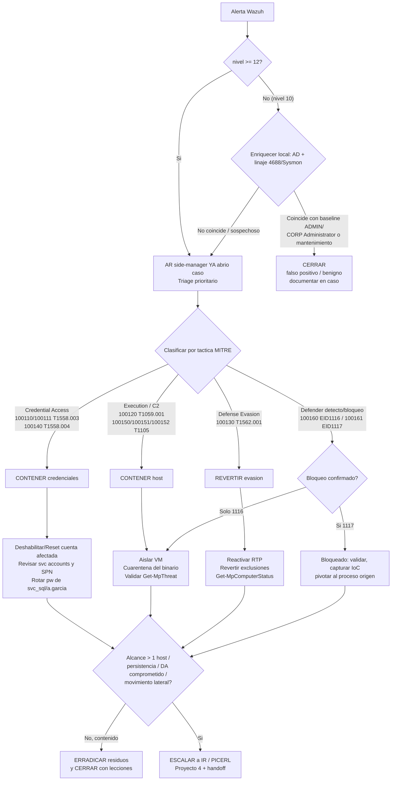

# Playbook SOC — Árbol de decisión de respuesta

Documento operativo para el triage y la respuesta inicial sobre las alertas del SIEM Wazuh 4.13.1 del lab `corp.local`. Cubre la decisión **contener / erradicar / escalar / cerrar** y el handoff a Incident Response (PICERL, Proyecto 4). Alcance: hasta la respuesta inicial. Operación por **PowerShell Direct** desde el host Hyper-V (red LAB-Net aislada, sin red de gestión).

## Hosts y planos de actuación

| Activo | IP | Rol | Planos de respuesta disponibles |
|---|---|---|---|
| DC01 (Windows Server 2025) | 10.10.10.10 | KDC / AD DS / DNS | Reset/deshabilitar cuentas AD, revisar SPN y grupos |
| WIN11 (Windows 11 Pro) | 10.10.10.21 | Endpoint, Sysmon + Defender | Get-MpThreat / reactivar RTP / cuarentena, linaje 4688/Sysmon |
| Wazuh manager | 10.10.10.20 | SIEM + Active Response | AR side-manager (apertura de caso), triage sobre alerts.json |

## Premisas de triage (de los hallazgos de caza, Proyecto 2)

- **Baseline known-good**: la mayoría del ruido es actividad de ADMIN (PS-remoting, reinstalación de Sysmon). Antes de contener, descartar `CORP\Administrator` y mantenimiento conocido.
- **Mito del RC4**: WS2025 negocia AES (0x12); la firma RC4 0x17 se evade. La detección **robusta** de Kerberoasting es el honeypot `svc_sql` (regla 100110, determinista): cualquier TGS hacia esa cuenta es malicioso, sin baseline que descartar.
- **Defensa en profundidad / pivote**: Defender 1116/1117 (100160/100161) confirma y, además, sirve de **pista de caza** para pivotar al proceso de origen.
- **Enriquecimiento**: externo (VirusTotal/AbuseIPDB/OTX) es **conceptual** (lab aislado, plantilla de IoC lookup). El real es **local**: AD, linaje Sysmon EID 1 + SHA256, histórico 4688 (regla base 67027), Get-MpThreat/Get-MpComputerStatus, log crudo con Get-WinEvent.

## Árbol de decisión



## Decisión por nivel y táctica

### 1) Nivel >= 12 — caso abierto automáticamente
La **Active Response side-manager** abre un caso (apertura de ticket + enriquecimiento de solo-lectura, segura) ante toda alerta de nivel >= 12: `100110`, `100120`, `100130`, `100140`, `100160`. No requiere disparo manual; el analista entra directo a triage prioritario.

### 2) Nivel 10 — triage antes de actuar
Reglas `100111`, `100150`, `100151`, `100152`, `100161`. No abren caso solas. Enriquecer en local y decidir: si coincide con baseline ADMIN/`CORP\Administrator` o mantenimiento conocido → **CERRAR** documentando; si no → escalar a la rama de táctica correspondiente.

### 3) Credential Access — `T1558.003` / `T1558.004`
Reglas `100110` (honeypot `svc_sql`, determinista), `100111` (RC4 0x17), `100140` (AS-REP, preAuth 0 contra `a.garcia`).
- **Contención**: deshabilitar o resetear la cuenta de origen del intento; **rotar la contraseña** de la cuenta señuelo comprometida (`svc_sql` pw `Summer2024!`, o `a.garcia`).
- **Revisar service accounts**: enumerar SPN y pertenencia a grupos. `svc_sql` (SPN `MSSQLSvc/sql01.corp.local:1433`, `msDS-SupportedEncryptionTypes=23`) y `a.garcia` (`DoesNotRequirePreAuth=True`) son honeypots: un TGS/AS-REP hacia ellas confirma intento de roasting sin más análisis.
- **No aislar el endpoint por defecto**: el ataque es contra el KDC (DC01); la contención es sobre la identidad, no sobre la VM.

### 4) Execution / C2 — `T1059.001` / `T1027` / `T1105`
Reglas `100120` (PowerShell ofuscado), `100150/100151/100152` (LOLBins certutil/bitsadmin/mshta).
- **Contención**: aislar la VM (apagar la NIC del adaptador en Hyper-V / detener la VM por PowerShell Direct, sin red) y poner el binario/payload en cuarentena.
- **Validar con Defender**: `Get-MpThreat` en WIN11. Precedente: certutil fue detectado+bloqueado como `Trojan:Win32/Ceprolad.A` (1116/1117) → defensa en profundidad.
- **Pivotar**: linaje del proceso (Sysmon EID 1 `parentImage` + SHA256) e histórico de 4688 para reconstruir la cadena de ejecución.

### 5) Defense Evasion — `T1562.001`
Regla `100130` (tamper de Defender: `Add-MpPreference`/`-ExclusionPath`/`DisableRealtimeMonitoring`/`Set-MpPreference`).
- **Revertir**: eliminar exclusiones añadidas y **reactivar Real-Time Protection (RTP)**.
- **Verificar estado**: `Get-MpComputerStatus` y confirmar que `RealTimeProtectionEnabled = True`.
- Tratar como precursor de Execution/C2: revisar qué se intentó ocultar tras desactivar la protección.

### 6) Defender detectó/bloqueó — `100160` (1116) / `100161` (1117)
- `100161` (EID 1117, **acción** bloqueo/cuarentena): amenaza ya contenida por el EDR → validar, capturar IoC y **pivotar** al proceso de origen para confirmar que no hay residuos.
- `100160` (EID 1116, solo **detección**) sin acción de bloqueo: tratar como Execution/C2 activo → contener host.

## Cuándo escalar a Incident Response (PICERL, Proyecto 4)

Escalar y abrir handoff a IR cuando, tras la respuesta inicial, se cumpla **cualquiera** de:
- Alcance **> 1 host** o evidencia de **movimiento lateral**.
- **Persistencia** instalada (p. ej. servicio nuevo `7045` con `imagePath` sospechoso — candidata `100170`, `T1543.003`).
- Compromiso de **identidad privilegiada** (`CORP\Administrator` / Domain Admins) o reset de credenciales con impacto en producción simulada.
- La contención no detiene la actividad o el alcance es incierto.

**Handoff a IR**: entregar el caso (abierto por la AR) con cronología, alertas/reglas implicadas, IoC recolectados (SHA256, cuentas, comandos), acciones de contención ya ejecutadas y estado de cada host. IR retoma desde **Identify/Contain** dentro del ciclo completo PICERL (Prepare/Identify/Contain/Eradicate/Recover/Lessons) en el Proyecto 4.

## Cuándo cerrar

- Nivel 10 que coincide con **baseline known-good** (ADMIN, PS-remoting, reinstalación de Sysmon) → cerrar como benigno, documentando la coincidencia.
- Amenaza **bloqueada por Defender** (`100161`/1117) sin residuos tras pivote → cerrar con IoC y lección.
- Alerta contenida y erradicada en un único host, sin persistencia ni alcance lateral → cerrar con lecciones aprendidas.

## Acciones de contención disponibles en el lab

| Acción | Plano | Cómo (lab aislado) |
|---|---|---|
| Aislar VM | Hyper-V / PS Direct | Desconectar el adaptador de red de la VM o detenerla; operación por PowerShell Direct (no hay red de gestión) |
| Deshabilitar cuenta AD | DC01 (PS Direct) | `Disable-ADAccount` / `Set-ADAccountPassword` sobre la cuenta afectada |
| Reactivar RTP / cuarentena | WIN11 (PS Direct) | `Set-MpPreference -DisableRealtimeMonitoring $false`; `Get-MpThreat` / `Get-MpComputerStatus` |
| Apertura de caso | Wazuh manager | Active Response side-manager automática para nivel >= 12 (solo-lectura, segura) |

> Variante cloud (Logic Apps / Sentinel) **no** se usa aquí: la automatización es nativa Wazuh (Active Response).

## Queries de apoyo al triage

**Apertura del día — alertas de respuesta automática (nivel >= 12) sobre el manager:**
```bash
jq -c 'select(.rule.level >= 12) | {ts:.timestamp, id:.rule.id, lvl:.rule.level, desc:.rule.description, agent:.agent.name}' /var/ossec/logs/alerts/alerts.json
```

**Kerberoasting honeypot (100110) — TGS hacia svc_sql, determinista:**
```bash
jq -c 'select(.rule.id=="100110") | {ts:.timestamp, target:.data.win.eventdata.targetUserName, src:.data.win.eventdata.ipAddress, enc:.data.win.eventdata.ticketEncryptionType}' /var/ossec/logs/alerts/alerts.json
```

**AS-REP Roasting (100140) — 4768 con preAuthType 0:**
```bash
jq -c 'select(.rule.id=="100140") | {ts:.timestamp, target:.data.win.eventdata.targetUserName, pre:.data.win.eventdata.preAuthType, src:.data.win.eventdata.ipAddress}' /var/ossec/logs/alerts/alerts.json
```

**LOLBins / PowerShell ofuscado — línea de comando y script para pivotar:**
```bash
jq -c 'select(.rule.id=="100120" or .rule.id=="100150" or .rule.id=="100151" or .rule.id=="100152") | {ts:.timestamp, id:.rule.id, agent:.agent.name, cmd:.data.win.eventdata.commandLine, sb:.data.win.eventdata.scriptBlockText}' /var/ossec/logs/alerts/alerts.json
```

**Defender (100160/100161) — amenaza y acción (campos con espacio):**
```bash
jq -c 'select(.rule.id=="100160" or .rule.id=="100161") | {ts:.timestamp, eid:.data.win.system.eventID, threat:.data.win.eventdata."threat Name", action:.data.win.eventdata."action Name"}' /var/ossec/logs/alerts/alerts.json
```

**Tamper de Defender (100130) — qué se intentó desactivar/excluir:**
```bash
jq -c 'select(.rule.id=="100130") | {ts:.timestamp, agent:.agent.name, cmd:.data.win.eventdata.commandLine}' /var/ossec/logs/alerts/alerts.json
```

**Candidata persistencia (100170) — servicio nuevo 7045:**
```bash
jq -c 'select(.data.win.system.eventID=="7045") | {ts:.timestamp, svc:.data.win.eventdata.serviceName, path:.data.win.eventdata.imagePath}' /var/ossec/logs/alerts/alerts.json
```

### Enriquecimiento local por PowerShell Direct

**AD — descartar baseline / privilegio (sobre DC01):**
```powershell
Get-ADUser -Identity svc_sql -Properties ServicePrincipalName,msDS-SupportedEncryptionTypes
Get-ADUser -Identity a.garcia -Properties DoesNotRequirePreAuth,MemberOf
```

**Endpoint — estado del EDR y amenazas (sobre WIN11):**
```powershell
Get-MpComputerStatus | Select-Object RealTimeProtectionEnabled, AntivirusEnabled
Get-MpThreat | Select-Object ThreatName, SeverityID, IsActive
```

**Linaje del proceso — log crudo (Sysmon EID 1 + 4688 en WIN11):**
```powershell
Get-WinEvent -FilterHashtable @{LogName='Microsoft-Windows-Sysmon/Operational'; Id=1} -MaxEvents 50 |
  Select-Object TimeCreated, @{n='Image';e={$_.Properties[4].Value}}, @{n='ParentImage';e={$_.Properties[20].Value}}, @{n='SHA256';e={$_.Properties[17].Value}}
```

### Contención por PowerShell Direct

```powershell
# Credential Access: contener identidad (sobre DC01)
Disable-ADAccount -Identity svc_sql
Set-ADAccountPassword -Identity svc_sql -Reset

# Defense Evasion: reactivar RTP (sobre WIN11)
Set-MpPreference -DisableRealtimeMonitoring $false

# Execution/C2: aislar VM desde el host Hyper-V (sin red)
Disconnect-VMNetworkAdapter -VMName 'WIN11'
```
